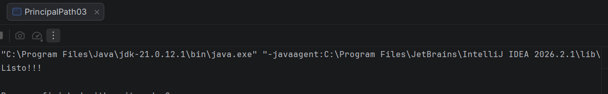

# Core avanzado: threading, manejo de archivos y serialización

## 1.1 Hilos y 1.2 Problemas de concurrencia.

### Código utilizado:
```Java
package org.example;
import java.util.concurrent.ExecutorService;
import java.util.concurrent.Executors;
import java.util.concurrent.TimeUnit;
import java.util.concurrent.atomic.AtomicInteger;

public class Main {
	
    // visitas inseguras sufre perdidas cuando entran vistas simultáneas
    private static int vistasInseguras = 0;

    // visitas seguras utiliza 'AtomicInteger' para garantizar que cada vista se cuente a nivel de hardware
    private static AtomicInteger vistasSeguras = new AtomicInteger(0);

    public static void main(String[] args) throws InterruptedException {
        int hilosServidores = 10;
        int vistasPorServidor = 1000;       // Cada servidor recibe 1,000 vistas
        int totalEsperado = hilosServidores * vistasPorServidor;

        System.out.println("=== ANALÍTICAS DE YOUTUBE EN TIEMPO REAL ===");
        System.out.println("Simulando " + hilosServidores + " servidores recibiendo " + vistasPorServidor + " vistas simultáneas cada uno...\n");

        //  ExecutorService para el manejo del pool de hilos 
        ExecutorService poolServidores = Executors.newFixedThreadPool(hilosServidores);

        //  simulacion de pool de hilos
        for (int i = 1; i <= hilosServidores; i++) {
            final int idServidor = i;
            poolServidores.submit(() -> {
                for (int j = 0; j < vistasPorServidor; j++) {
                    // Operación insegura 
                    vistasInseguras++;

                    // Operación segura 
                    vistasSeguras.incrementAndGet();
                }
                System.out.println("[Servidor " + idServidor + "] Terminó de registrar sus 1,000 vistas.");
            });
        }

      
        poolServidores.shutdown();
        poolServidores.awaitTermination(5, TimeUnit.SECONDS);

        // comparacion de resultados, sin AtomicInteger - con AtomicInteger y visitas esperadas
        System.out.println("\n=== RESULTADO FINAL DE VISTAS EN EL CANAL ===");
        System.out.println("Vistas reales recibidas (Esperado): " + totalEsperado);
        System.out.println("Contador INSEGURO (int normal):    " + vistasInseguras );
        System.out.println("Contador SEGURO (AtomicInteger):   " + vistasSeguras.get() + " Resultado real con AtomicInteger");
    }
}
```
## Concepto:
### Hilos y concurrencia
El uso de hilos dentro del programa permite a nuestro sistema poder detectar sin perdida la cantidad de visitas de cada video de youtube.
En caso de no usar multihilos y solamente existiera uno, nuestros servidores al recibir una visita nueva haciendo sobreescriban uno arriba del otro la información recibida.
Es decir que en caso de recibir 1 visita al mismo tiempo ocurre un **Race Condition** haciendo que esas visitas queden en el limbo y no se registren correctamente como en el caso de **VisitasInseguras**.
Aquí es donde entra nuestros hilos/Runnable
 ```Java
 poolServidores.submit(() -> {
    for (int j = 0; j < vistasPorServidor; j++) {
        vistasInseguras++;
        vistasSeguras.incrementAndGet();
    }
    System.out.println("[Servidor " + idServidor + "] Terminó de registrar sus 1,000 vistas.");
});
  ```
**Visitas Seguras:** trabajo del multihilo y con **AtomicInteger** permitiendo a nuestro sistema trabaje con los diferentes hilos y tomen su tiempo para escribir y mandar lo que reescribieron haciendo que las perdidas de visitas sean nulas. Dando los resultados reales.

**ExecutorService:**
```Java
ExecutorService poolServidores = Executors.newFixedThreadPool(hilosServidores);
```
Administración de hilo para evitar hacer/Crear/Administrar hilos manualmente.

### Resultado:


--------------------------------------