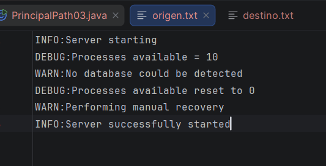
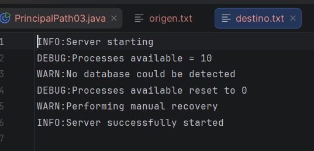
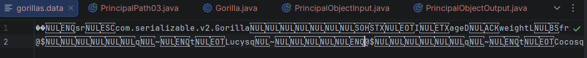
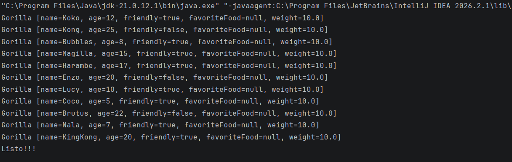

# Core avanzado: threading, manejo de archivos y serialización

## 1.1 Hilos y 1.2 Problemas de concurrencia.

### Código utilizado:
```Java
package org.example;
import java.util.concurrent.ExecutorService;
import java.util.concurrent.Executors;
import java.util.concurrent.TimeUnit;
import java.util.concurrent.atomic.AtomicInteger;

public class Main {
	
    // visitas inseguras sufre perdidas cuando entran vistas simultáneas
    private static int vistasInseguras = 0;

    // visitas seguras utiliza 'AtomicInteger' para garantizar que cada vista se cuente a nivel de hardware
    private static AtomicInteger vistasSeguras = new AtomicInteger(0);

    public static void main(String[] args) throws InterruptedException {
        int hilosServidores = 10;
        int vistasPorServidor = 1000;       // Cada servidor recibe 1,000 vistas
        int totalEsperado = hilosServidores * vistasPorServidor;

        System.out.println("=== ANALÍTICAS DE YOUTUBE EN TIEMPO REAL ===");
        System.out.println("Simulando " + hilosServidores + " servidores recibiendo " + vistasPorServidor + " vistas simultáneas cada uno...\n");

        //  ExecutorService para el manejo del pool de hilos 
        ExecutorService poolServidores = Executors.newFixedThreadPool(hilosServidores);

        //  simulacion de pool de hilos
        for (int i = 1; i <= hilosServidores; i++) {
            final int idServidor = i;
            poolServidores.submit(() -> {
                for (int j = 0; j < vistasPorServidor; j++) {
                    // Operación insegura 
                    vistasInseguras++;

                    // Operación segura 
                    vistasSeguras.incrementAndGet();
                }
                System.out.println("[Servidor " + idServidor + "] Terminó de registrar sus 1,000 vistas.");
            });
        }

      
        poolServidores.shutdown();
        poolServidores.awaitTermination(5, TimeUnit.SECONDS);

        // comparacion de resultados, sin AtomicInteger - con AtomicInteger y visitas esperadas
        System.out.println("\n=== RESULTADO FINAL DE VISTAS EN EL CANAL ===");
        System.out.println("Vistas reales recibidas (Esperado): " + totalEsperado);
        System.out.println("Contador INSEGURO (int normal):    " + vistasInseguras );
        System.out.println("Contador SEGURO (AtomicInteger):   " + vistasSeguras.get() + " Resultado real con AtomicInteger");
    }
}
```
## Concepto:
### Hilos y concurrencia
El uso de hilos dentro del programa permite a nuestro sistema poder detectar sin perdida la cantidad de visitas de cada video de youtube.
En caso de no usar multihilos y solamente existiera uno, nuestros servidores al recibir una visita nueva haciendo sobreescriban uno arriba del otro la información recibida.
Es decir que en caso de recibir 1 visita al mismo tiempo ocurre un **Race Condition** haciendo que esas visitas queden en el limbo y no se registren correctamente como en el caso de **VisitasInseguras**.
Aquí es donde entra nuestros hilos/Runnable
 ```Java
 poolServidores.submit(() -> {
    for (int j = 0; j < vistasPorServidor; j++) {
        vistasInseguras++;
        vistasSeguras.incrementAndGet();
    }
    System.out.println("[Servidor " + idServidor + "] Terminó de registrar sus 1,000 vistas.");
});
  ```
**Visitas Seguras:** trabajo del multihilo y con **AtomicInteger** permitiendo a nuestro sistema trabaje con los diferentes hilos y tomen su tiempo para escribir y mandar lo que reescribieron haciendo que las perdidas de visitas sean nulas. Dando los resultados reales.

**ExecutorService:**
```Java
ExecutorService poolServidores = Executors.newFixedThreadPool(hilosServidores);
```
Administración de hilo para evitar hacer/Crear/Administrar hilos manualmente.

### Resultado:


--------------------------------------

## 1.3 Manejo de Archivos Y Streams

**Manejo de Archivos:** El manejo de archivos permite a nuestro sistema interactuar directamente con archivos del SO. para lograr persistencia en los datos de bajo nivel, permitiendo asi ser guardados en formatos como JSON o CSV.

### Código utilizado Clase PrinipalPath03:
 Tomado de proyectos antiguos proporcionados por el Ing.Miguel
```Java

public class PrincipalPath03 {

	public static void main(String[] args) throws IOException {

		String currentDir = System.getProperty("user.dir");
		Path pathInput = Paths.get(currentDir, "data", "origen.txt");

		Path pathOutput = Paths.get(currentDir, "data", "destino.txt");
		copyPath(pathInput, pathOutput);

		System.out.println("Listo!!!");

	}

	static private void copyPath(Path input, Path output) throws IOException {

		try (BufferedReader reader = Files.newBufferedReader(input); 
			 BufferedWriter writer = Files.newBufferedWriter(output)) {

			String line = null;

			while ((line = reader.readLine()) != null) {
				writer.write(line);
				writer.newLine();
			}
		}
	}
}

```
**Try-With-Resources:** Sirve para leer y escribir información en archivos para evitar la saturación de disco.

		try (BufferedReader reader = Files.newBufferedReader(input); 
			 BufferedWriter writer = Files.newBufferedWriter(output))

### Resultado
Al correr el programa PrincipalPath03, debera salir el path y un mensaje de listo.

Origen: El origen es el text que se enviara al destino

Destino, debe estar vacio al comenzar, pero al correr el programa debera aparecer informacion dentro del destino.txt

## 1.4 Serialización y Deserializacion.
La serialización es utilizada para convertir un objeto a bytes para poder almacenarlo o trasmitirlo despues. Haciendo un tipo "clonado" para despues poder pasarlo por una **Deserialización** 
### Código clase:
```java 
package com.serializable.v2;

import java.io.Serializable;

class Gorilla implements Serializable {

	private static final long serialVersionUID = 1L;
	private String name;
	private int age;
	private Boolean friendly;
	private transient String favoriteFood;
	private double weight = 10;

	public Gorilla(String name, int age, Boolean friendly, String favoriteFood) {
		this.name = name;
		this.age = age;
		this.friendly = friendly;
		this.favoriteFood = favoriteFood;}

	public String getName() {
		return name;}

	public void setName(String name) {
		this.name = name;}

	public int getAge() {
		return age;}

	public void setAge(int age) {
		this.age = age;}

	public Boolean getFriendly() {
		return friendly;}

	public void setFriendly(Boolean friendly) {
		this.friendly = friendly;}

	public String getFavoriteFood() {
		return favoriteFood;}

	public void setFavoriteFood(String favoriteFood) {
		this.favoriteFood = favoriteFood;}

	@Override
	public String toString() {
		return "Gorilla [name=" + name + ", age=" + age + ", friendly=" + friendly + ", favoriteFood=" + favoriteFood
				+ ", weight=" + weight + "]";}}
```
**SerialVersionUID**: Sirve para que java al guardar el objeto sea guardado junto a este valor completo, al leerlo despues java compara este numero para no tener problemas a la hora de recuperarlo.

### Código Prinicpal output:
```java 
public class PrincipalObjectOutput {

	public static void main(String[] args) throws IOException {
		
		String currentDir = System.getProperty("user.dir");
        File file = new File(currentDir + "/data/gorillas.data");
        List<Gorilla> gorillas = new ArrayList<>();
        
        gorillas.add(new Gorilla("Koko", 12, true, "Bananas"));
        gorillas.add(new Gorilla("Kong", 25, false, "Frutas tropicales"));
        gorillas.add(new Gorilla("Bubbles", 8, true, "Manzanas"));
        gorillas.add(new Gorilla("Magilla", 15, true, "Nueces"));
        gorillas.add(new Gorilla("Harambe", 17, true, "Hojas verdes"));
        gorillas.add(new Gorilla("Enzo", 20, false, "Caña de azúcar"));
        gorillas.add(new Gorilla("Lucy", 10, true, "Bayas"));
        gorillas.add(new Gorilla("Coco", 5, true, "Mangos"));
        gorillas.add(new Gorilla("Brutus", 22, false, "Melones"));
        gorillas.add(new Gorilla("Nala", 7, true, "Plátanos"));
        gorillas.add(new Gorilla("KingKong", 20, true, "Plátanos"));
        
        saveToFile(gorillas,file);
        
        System.out.println("Listo!!!");
	}

	static void saveToFile(List<Gorilla> gorillas, File dataFile) throws IOException {
		try (var out = new ObjectOutputStream(
					   new BufferedOutputStream(
					   new FileOutputStream(dataFile)))) {

			for (Gorilla gorilla : gorillas)

				out.writeObject(gorilla);}}}
```
**¿Qué hace OUTPUT?:** Al iniciar el programa y que todo pase correctamente debera salir LISTO en nuestra consola y generando un text de gorilla donde contenga nuestro contenido Serializado.


### Código Prinicpal Input:
```java 
public class PrincipalObjectInput {

	public static void main(String[] args) throws IOException, ClassNotFoundException {

		String currentDir = System.getProperty("user.dir");
		File file = new File(currentDir + "/data/gorillas.data");

		List<Gorilla> gorillas = readFromFile(file);
		
		gorillas.forEach(System.out::println);
		
		System.out.println("Listo!!!");
	}
static List<Gorilla> readFromFile(File dataFile) throws IOException, ClassNotFoundException {

		var gorillas = new ArrayList<Gorilla>();

		try (var in = new ObjectInputStream(
				      new BufferedInputStream(
				      new FileInputStream(dataFile)))) {
			while (true) {
				var object = in.readObject();
				if (object instanceof Gorilla g)
					gorillas.add(g);
			}
		} catch (EOFException e) {
			return gorillas;
		}}}
```
**¿Qué hace INPUT?:** Al iniciar el programa y que todo pase correctamente debera salir LISTO además de nuestro objeto ya deserializado en nuestra consola, en caso de no pasar por el Output primero nos deberia tirar una exception..


**Transient**: Es utilizado para que ignore y no puedan ser serializadas, utilizada para datos sensibles.