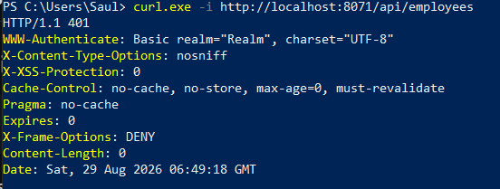
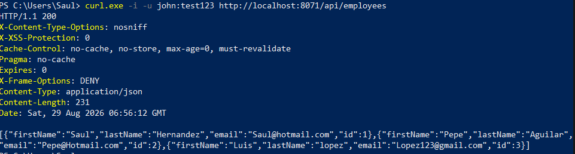
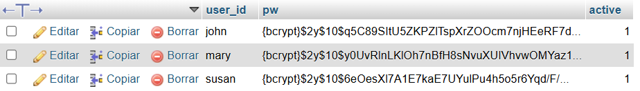
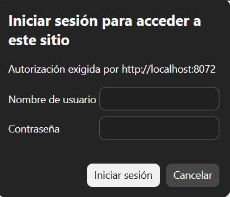
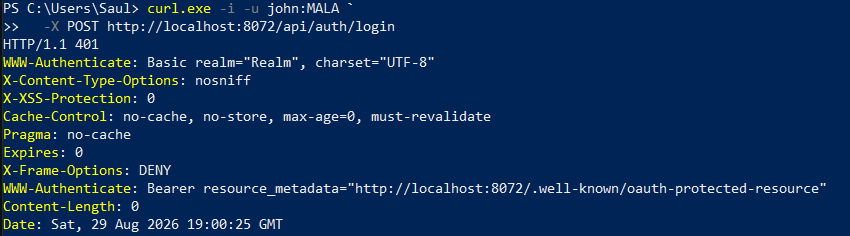

# 02-Spring-Security

### **2.1 HTTP BASIC** 
Http basic es el modo de autenticacion más básico como su nombre lo dice en el cual se define en el protocolo HTTP.

En donde el usuario es unido solamente con su usuario y contraseña para asi generar su credencial en una cadena codificada con Base64.


### Prueba PowerShell Sin credenciales.
```shell
curl.exe -i http://localhost:8071/api/employees
```
Error 401 ya que no permite iniciar sin credenciales.


### Qué pasa si no lo usas:
Si no se utiliza aunque sea seguridad básica cualquier persona con el URL podria modificar tu Base de Datos y eliminar registros, al tener nuestro Http basic nos aseguramos que solo las credenciales correspondientes puedan acceder a la BD.
```java
@Bean
    public SecurityFilterChain filterChain(HttpSecurity http) throws Exception {

        http.authorizeHttpRequests(configurer -> configurer
                .requestMatchers(HttpMethod.GET, "/api/employees").hasRole("EMPLOYEE")
                .requestMatchers(HttpMethod.GET, "/api/employees/**").hasRole("EMPLOYEE")
                .requestMatchers(HttpMethod.POST, "/api/employees").hasRole("MANAGER")
                .requestMatchers(HttpMethod.PUT, "/api/employees").hasRole("MANAGER")
                .requestMatchers(HttpMethod.PATCH, "/api/employees/**").hasRole("MANAGER")
                .requestMatchers(HttpMethod.DELETE, "/api/employees/**").hasRole("ADMIN")
                .anyRequest().authenticated());

        http.httpBasic(Customizer.withDefaults());
```
Con el código de filterChain nos aseguramos que solo el rol que esta en **.hasRole** tenga acceso a las rutas con las cual es tiene permiso.
**HttpsBasic** exige que cada petición vaya con las credenciales para hacer posible la accion.

### Prueba PowerShell con credenciales de lectura.
```shell
curl.exe -i -u john:test123 http://localhost:8071/api/employees
```


### Bcrypt en BD

Gracias a bcrypt obtenemos nuestra credenciales Hasheadas como se puede ver en la imagen. Esto en vez de que aparezca directamente las credenciales usadas como contraseña en caso de que se intente colocar credenciales sin el hasheo bcrypt el sistema debera bloquearlo automaticamente.


--------------------------------

### **2.2 JWT** 
Jwt deja de lado la petición de credenciales por cada envio, cambiandolo por un solo una inserción de las credenciales para despues pasar a utilizar los famosos Token de Auth.

**End Points**
```url
http://localhost:8072/api/auth/login
http://localhost:8072/api/employees
```


Inicio de credenciales por primera vez que devuelve el token para que el usuario tenga como si fuera un firma "digital" entre el backend y front totalente encriptada, solamente aqui se puede colocar las credenciales para que sea generado el token hasheado para despues.

## Código - Configuracion End Points 
```java
@RestController
@RequestMapping("/api/auth")
public class AuthController {
    public record TokenResponse(String accessToken, String tokenType, long expiresIn, String user) {
    }
        private final JwtEncoder jwtEncoder;
        private final long ttlSeconds;

    public AuthController(JwtEncoder theJwtEncoder,
            @Value("${jwt.ttl-seconds}") long theTtlSeconds) {
        jwtEncoder = theJwtEncoder;
        ttlSeconds = theTtlSeconds;
    }
```
**@RestController**: Es el manejador encargado de las peticiones HTTP rest que convierte a formato JSON.

**@RequestMapping("/api/auth/"):** es el encargado de definir el prefijo de la URL para que podamos iniciar sesion.
```Java
@PostMapping("/login")
    public TokenResponse login(Authentication authentication) {

        Instant ahora = Instant.now();

        List<String> roles = authentication.getAuthorities().stream()
                .map(GrantedAuthority::getAuthority)
                .filter(authority -> authority.startsWith("ROLE_"))
                .collect(Collectors.toList());

```
## **401 Unauthorized**:
el sistema al detectar credenciales que no coinciden y querer hacer un POST, como no coincide el token te lanza  *401 Unauthorized*

### De que sirve usar JWT:
Sirve principalmente para problemas con la escalabilidad ya que no guarda nada en la memoria RAM permitiendo asi una eficiencia por el token ya que el sistema solo detecta y verifica el token rapidamente y la procesa sin necesidad de entrar a la base de datos.

-----------------------------------------
