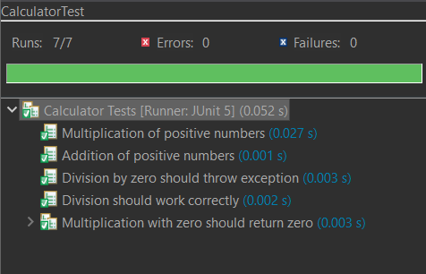

# 04-unit-testing

## ¿Qué es Junit?

El Junit es el framework encargado de que podamos realizar pruebas unitarias para java.
Permitiendonos automatizar pruebas y repetirlas.

## Qué pasa si no lo usas

Al no usar pruebas automaticas, en caso de querer probar nuestro código tocara hacer pruebas manuales haciendo que perdamos eficiencia y tiempo probando paso a paso casa funcion que quieras probar en tu código.

## Código de pruebas unitarias

```java
@DisplayName("Calculator Tests")
class CalculatorTest {

    private Calculator calculator;

    @BeforeEach                                         
    void setUp() {
        calculator = new Calculator();
    }
 @Test                                               
    @DisplayName("Multiplication of positive numbers")  
    void testMultiplyPositiveNumbers() {
        assertEquals(20, calculator.multiply(4, 5),     
                "4 * 5 should equal 20");               
    }
@RepeatedTest(3)                                    
    @DisplayName("Multiplication with zero should return zero")
    void testMultiplyWithZero() {
        assertEquals(0, calculator.multiply(0, 5), "0 * 5 should equal 0");
        assertEquals(0, calculator.multiply(5, 0), "5 * 0 should equal 0");
    }
@Test
    @DisplayName("Addition of positive numbers")
    void testAddPositiveNumbers() {
        assertEquals(9, calculator.add(4, 5), "4 + 5 should equal 9");
    }
 @Test
    @DisplayName("Division should work correctly")
    void testDivision() {
        assertEquals(2.5, calculator.divide(5.0, 2.0), 0.001, "5.0 / 2.0 should equal 2.5");
    }
@Test
    @DisplayName("Division by zero should throw exception")
    void testDivisionByZero() {
        assertThrows(IllegalArgumentException.class,
            () -> calculator.divide(5.0, 0.0),
            "Division by zero should throw IllegalArgumentException");
    }
}
```
Se pueden observar varias pruebas unitarias que prueban el código de la calculadora.

**@DisplayName:** Arroja el nombre de nuestro test al ejectuar.

**@Test** Es la anotación que le dice a nuestro programa que es un test que se tiene que ejecutar automaticamente inciado el programa.

**@BeforeEach**  Es el ciclo de vida y ayuda para cada *@test* tenga un ambiente limpio para que no ocurra errores no deseados.

**@RepeatTest** es la cantidad de veces que quieres repetir esa prueba.

## Pruebas ejecutadas.


----------------------------------------------------------

## ¿Qué es Mockito?
Mockito es un framewok que igual nos ayuda al testeo de objetos creando imitaciones de los objetos, donde se inmitan el comportamiento real de las clases. Estas actuan como si fueran totalmente reales pero son "Mock".

## Problema que resuelve: 
Se puede utilizar sin cosas extras como BD no es necesario conectarse para poder testear.
## Qué pasa si no lo usas
Al igual que Junit al no utilizar pruebas automatizadas tendriamos que ejecutar en caso de querer comprobar pruebas manuales.
Y en caso de tener escenarios extremos nos resultaria imposible testear nuestro código

## Código
```java
@ExtendWith(MockitoExtension.class)
@DisplayName("Mockito inyecta en el test lo que Spring inyectara en produccion")
class InyeccionTest {

	@Mock
	private ICalculoComplejo icc;

	@InjectMocks
	private ServiceCalculoImpuesto service;

	@Test
	@DisplayName("El servicio llega construido y con su colaborador dentro")
	void seInyectaPorConstructor() {
		
		assertNotNull(service, "@InjectMocks debio construirlo usando el constructor");
	}

	@Test
	@DisplayName("Y funciona igual que con la inyeccion de verdad")
	void elServicioDelegaEnElColaboradorInyectado() {
		when(icc.ejecutaCalculoComplejo((byte) 30, (char) 100, (short) 1000, 77777, 44444L, 90.90F))
				.thenReturn(999.99);

		assertEquals(999.99, service.calcularImpuesto());

		verify(icc).ejecutaCalculoComplejo((byte) 30, (char) 100, (short) 1000, 77777, 44444L, 90.90F);
	}
}
```
**@ExtendWith**  integra mockito junto Junit 

**@Mock** : Crea el mock u objeto falso y no hace nada hasta ser definido en **When**

**@InjectMocks** crea una instancia de la clase en este caso calculoimpuesto e intenta inyectar los objetos que estan marcados por las notaciones.

## por qué mockear:
porque es fundamental en las pruebas unitarias para aislar el código que estás probando y asegurar que el test sea rapido y confiable. 

- se puede detectar errores en la lógica de programación con el testeo.
- No es necesario levantar un servidor de BD
- evitar modificar o duplicar registros.

-------------------------------------------


