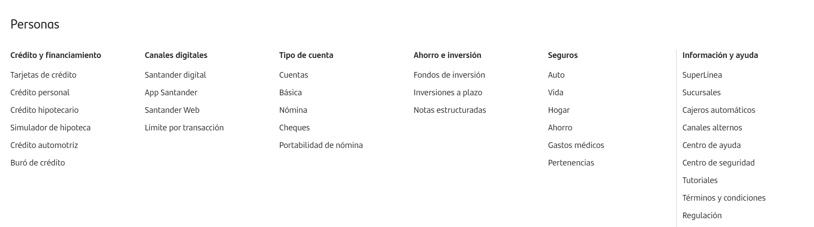

# Automatización Menú Santander

Proyecto de ejemplo con Java 21, Maven, Selenium WebDriver, TestNG y Page Object Model. Que permite verificar el funcionamiento del portal de santander.


## Requisitos

- JDK 21 y en Eclipse.
- Maven 3.9 o superior.
- Google Chrome instalado.
- Acceso a Internet en la primera ejecución para que Selenium Manager resuelva ChromeDriver.


## Funcionamiento del código.
**BasePage.Java**: SuperClase para los objectos Page. **Contenido**: Contiene metodos comunes y la inicialización de los elementos web.

**SantanderHomePage.java:** Extend de BasePage que contiene las constantes con las direcciones de cada uno de los elementos de la página que se desea testear.  

* Métodos para la interaccion con el menú desplegable de nuestra página, para asegurar la espera de tiempos o en este caso por las animaciones de menú para a evitar fallos en los test.
* Métodos de navegacion.

**DriverFactoy.java** es la clase encargada de instanciar y configurar el navegador web. Facilitando la reutilización de la sesión del navegador a lo largo de las pruebas.

**BaseTest.java** 
* @BeforeMethod: Inicializa el driver, configura las esperas implícitas/explícitas y abre la URL de la aplicación antes de cada prueba.
* @AfterMethod: Cierra el navegador (driver.quit()) al finalizar cada caso de prueba para mantener un entorno limpio.

**SantanderTest.Java:**

10 test dividido entre el menú del portal de Santander.
divido, para llevar mejor control en caso de pruebas falladas.

 ## Test creados
- testCreditoYFinanciamientoCompleto

- testCanalesDigitales

- testTiposDeCuenta

- testAhorroEInversion

- testSeguros

- testInformacionYAyuda

- testEmpresas

- testPymes

- testBancaPrivada

- testAcercaDelBanco


Test Case a probar que cubren el 100% del portal de 
Santander

----------------------
**Testng.xml:** 
permite configurar, organizar y ejecutar un conjunto de pruebas automatizadas sin necesidad de ejecutar las clases de forma individual desde el IDE.

**TestOUTPUT** Reportes de nuestros casos de prueba y screenshot's.


## Ejecutar en Eclipse

1. Importar con **File > Import > Existing Maven Projects**.
2. Seleccionar **Maven > Update Project**.
3. Abrir `src/test/java/tests/LoginTest.java`.
4. Ejecutar **Run As > TestNG Test**.

## Ejecutar con Maven

```bash
mvn clean test
```