# AWS Fundamentos 

**Proyecto:** TaskFlow API  
**Servicios utilizados:** AWS Budgets, IAM, EC2, RDS y S3  

## Objetivo

En esta práctica, se llevó la API TaskFlow a AWS. Primero se crearon controles básicos de seguridad y costos. Después se preparó una máquina EC2, se instaló Java, se subió el archivo JAR y se levantó la aplicación. Finalmente se creó una base de datos PostgreSQL en RDS y un bucket privado en S3.

## 1. Presupuesto y acceso a AWS

Se configuró un presupuesto mensual para ayudar a recibir alertas antes de gastar más de lo esperado.

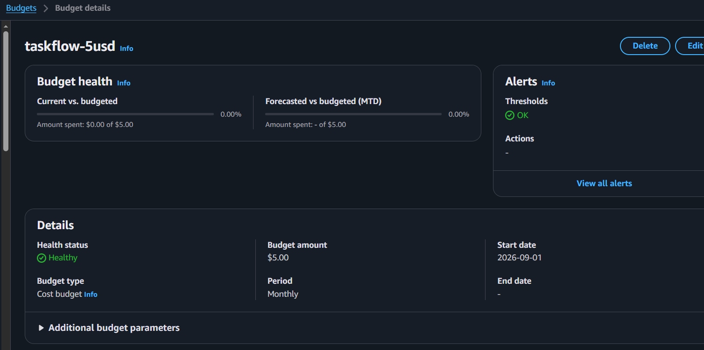

**Captura 1.** Se creó el presupuesto mensual para controlar el costo de los recursos utilizados durante la práctica.

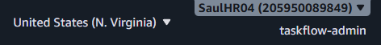

**Captura 2.** Se verificó el perfil del usuario IAM con el que se ingresó a la consola de AWS.

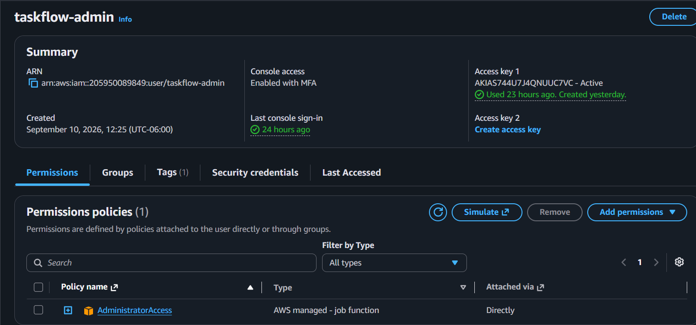

**Captura 3.** Se revisó la configuración de permisos o rol de IAM, que permite asignar accesos de forma controlada en AWS.

## 2. Creación de la instancia EC2

Se creó una instancia EC2 con Amazon Linux. Esta instancia funciona como un servidor remoto donde se ejecuta la API. Durante el proceso se eligió un nombre para la instancia, se generó una llave privada y se configuraron las reglas de red necesarias.

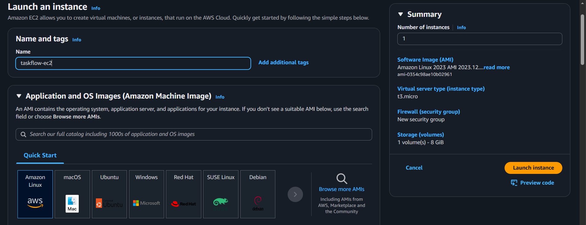

**Captura 4.** Se configuraron los datos principales de la instancia EC2 antes de lanzarla.

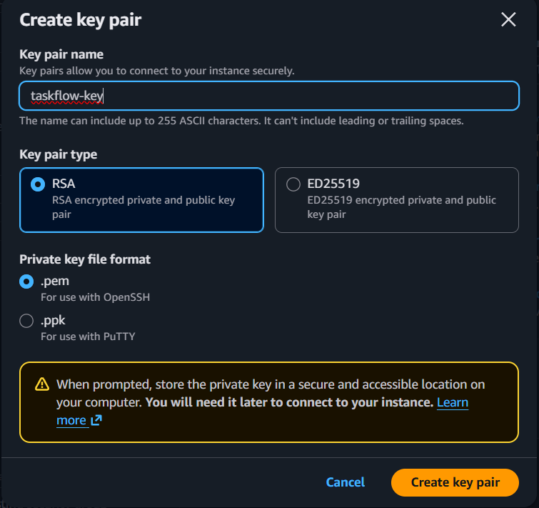

**Captura 5.** Se creó el key pair. El archivo **.pem** descargado sirve para comprobar la identidad al conectarse por SSH.

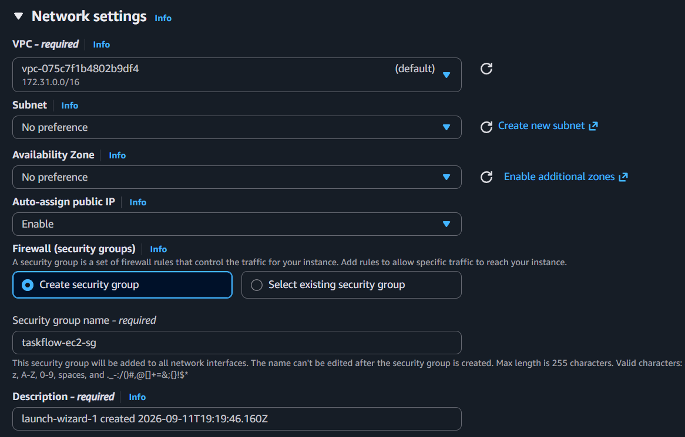

**Captura 6.** Se configuró el security group de EC2. Se habilitó SSH para administrar la máquina y el puerto 8080 para consultar la API.

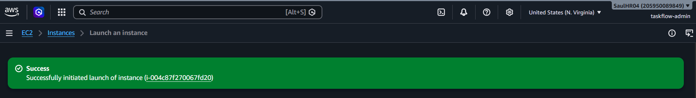

**Captura 7.** AWS confirmó que la solicitud para lanzar la instancia fue enviada correctamente.

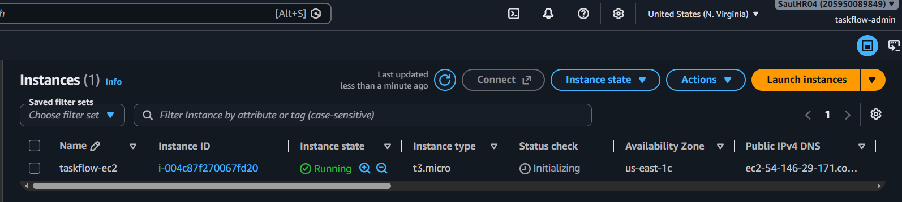

**Captura 8.** Se comprobó que la instancia ya estaba en estado **Running**, por lo que el servidor estaba listo para usarse.

## 3. Conexión remota e instalación de Java

Para entrar al servidor, se utilizó la llave privada y el usuario **ec2-user**. Una vez dentro de EC2, se instaló Amazon Corretto 21, que es la versión de Java necesaria para ejecutar el JAR de TaskFlow.

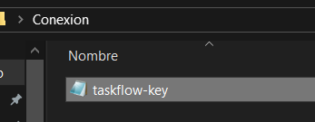

**Captura 9.** Se preparó la carpeta que contiene la llave necesaria para conectarse de forma segura a la instancia.

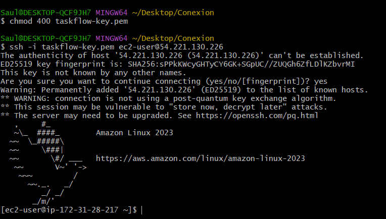

**Captura 10.** Se realizó la conexión por SSH a la instancia EC2. 

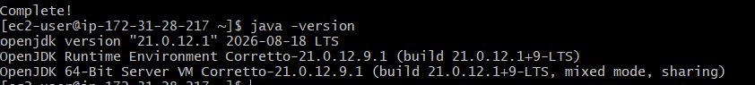

**Captura 11.** Se instaló Java 21 Amazon Corretto y se verificó la versión desde la terminal del servidor.

## 4. Transferencia y primer arranque de la API

Se compiló TaskFlow en el equipo local y se transfirió el archivo JAR a EC2. 

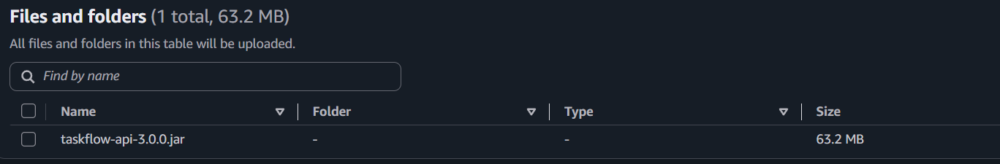

**Captura 12.** Se seleccionó el archivo JAR generado por el proyecto para transferirlo al servidor.

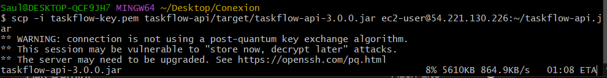

**Captura 13.** Se comprobó que el archivo **taskflow-api.jar** ya se encontraba en la instancia EC2.

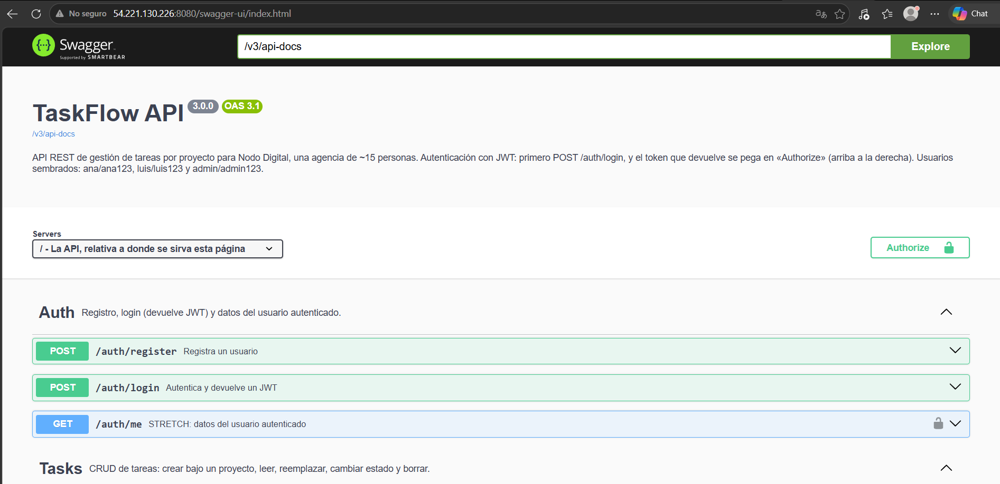

**Captura 14.** Se inició la API con Java y se revisó el registro de **Auth/login** para confirmar que el arranque fue correcto.

--------------------------------------------------------------------------
## 5. Creación de la base de datos RDS PostgreSQL

Se creó una base de datos PostgreSQL en Amazon RDS. RDS permite guardar los datos fuera de la instancia EC2. Así, los datos no dependen del disco de una sola máquina virtual..

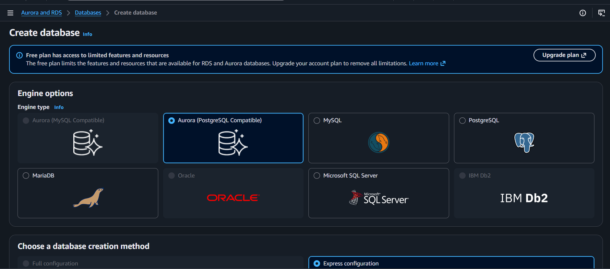

**Captura 15.** Se ingresó al servicio RDS para comenzar la creación de la base de datos.

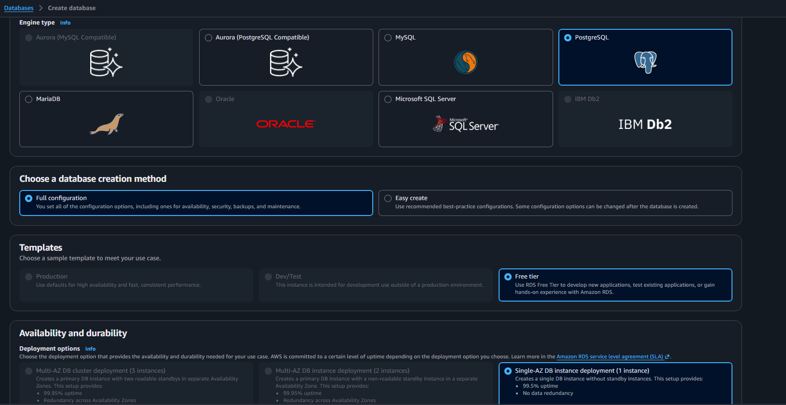

**Captura 16.** Se eligió PostgreSQL y se configuraron los datos generales de la instancia de base de datos.

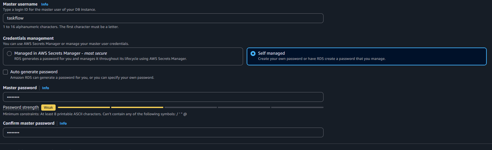

**Captura 17.** Se completó la configuración de credenciales, almacenamiento y conectividad de la base de datos RDS.

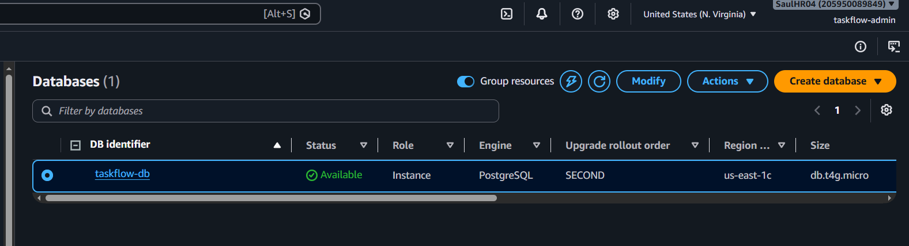

**Captura 18.** Se verificó que la base de datos PostgreSQL fue creada y quedó disponible en RDS.

## 6. Bucket privado en S3

Se creó un bucket de S3 para guardar el JAR como artefacto. El bucket se dejó privado: abrir la URL directa de un objeto debe mostrar un error de acceso. Esto es correcto porque el archivo no fue publicado para todo Internet.

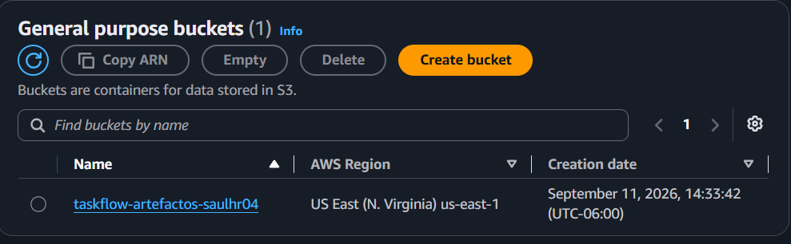

**Captura 19.** Se inició la creación del bucket de S3 y se definieron sus datos básicos.

.PNG>)

**Captura 20.** Se dejó activado el bloqueo de acceso público antes de crear el bucket.

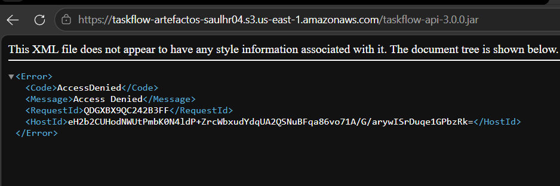

**Captura 21.** Se comprobó que la URL directa del objeto responde con acceso denegado. Esto demuestra que el bucket continúa privado.

## 7. Conexión segura entre EC2 y RDS

Para que la API pudiera usar PostgreSQL, se abrió el puerto 5432 en el security group de RDS. La regla añadida es al security group de EC2, no a una IP pública. Con esto solo la instancia autorizada puede intentar conectarse a la base de datos.

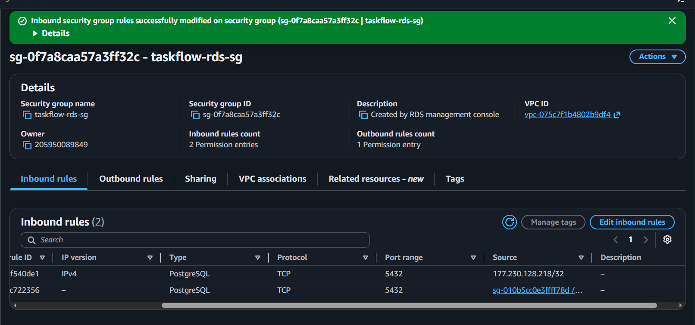

**Captura 22.** Se agrego la regla de entrada para PostgreSQL en el puerto 5432 y se autorizó como origen al security group de EC2.

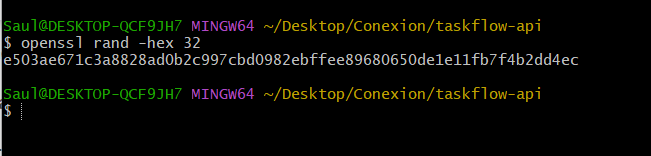

**Captura 23.** Se genero un token JWT nuevo para la ejecución de la API. 

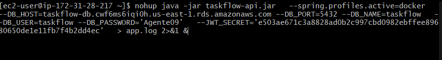

**Captura 24.** Se inició la aplicación usando las variables necesarias, incluyendo la configuración del token JWT.

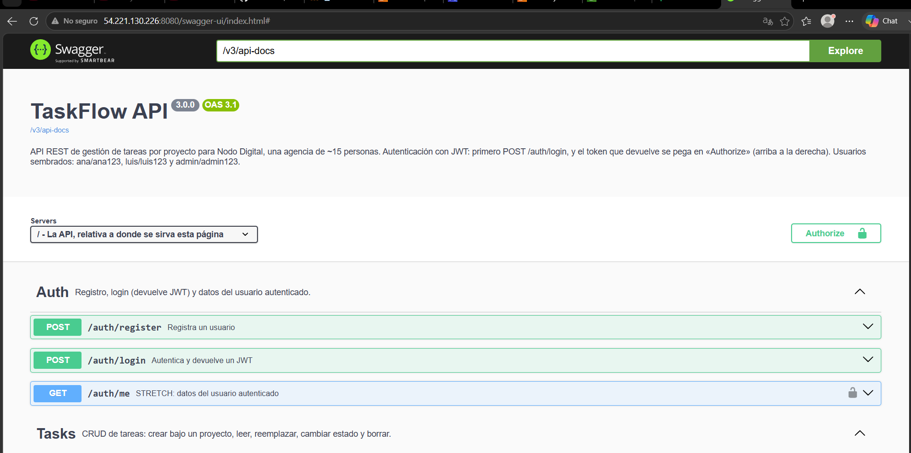

**Captura 25.** Se levantó TaskFlow conectada a PostgreSQL en RDS. Con esto, la API dejó de depender de una base de datos local dentro de EC2.

##  Repositorio y conexión

 Se creo un repositorio en GitHub para guardar el codigo de TaskFlow. Después se hizo el primer commit y se creo una conexión entre AWS y GitHub mediante AWS CodeConnections. Esta conexión permitirá que AWS consulte el repositorio sin exponer contraseñas ni tokens dentro del proyecto.

### 1. Creación del repositorio

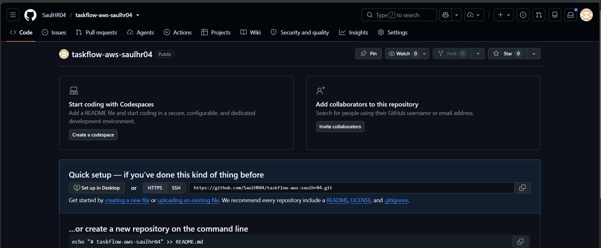

**Captura 26.** Se creo el repositorio **taskflow-aws-saulhr04** en GitHub. En este punto todavía no contenía archivos.

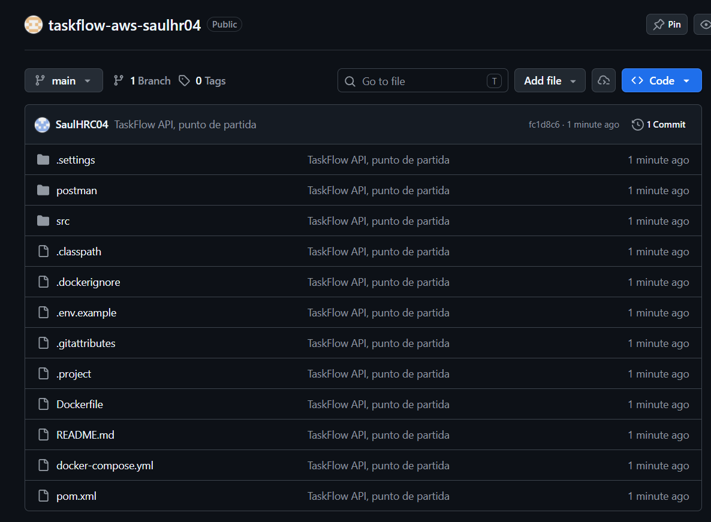

**Captura 27.** Se realizó el primer commit y se subieron los archivos iniciales de TaskFlow al repositorio.

### 2. Conexión de AWS con GitHub

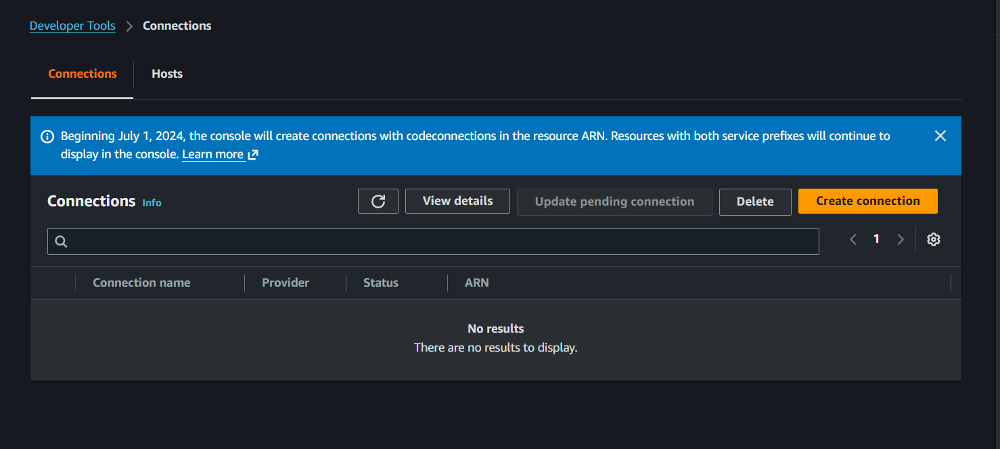

**Captura 28.** Se ingresó a AWS CodeConnections y se selecciono la opción para crear una conexión nueva con un proveedor de código.

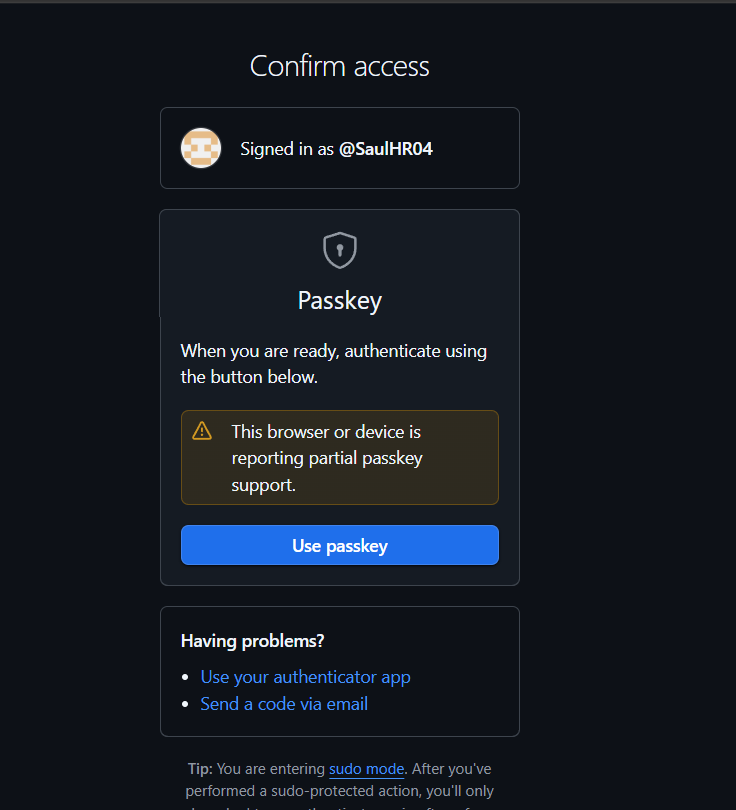

**Captura 29.** Se autorizó el acceso de AWS a la cuenta de GitHub. 

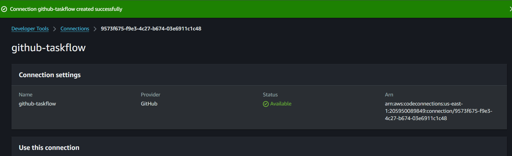

**Captura 30.** Se confirmó que la conexión **github-taskflow** quedó disponible. Esta será utilizada más adelante para enlazar el repositorio con los servicios de despliegue de AWS.

##  Prework para DynamoDB y practica con DynamoDB

Antes de crear la tabla se creó el rol que utilizará la nueva instancia EC2 durante el siguiente despliegue y se relanzó la instancia con dicho rol.

### 1. Configuración de credenciales para AWS CLI

La AWS CLI necesita credenciales del usuario IAM para realizar acciones en la cuenta..

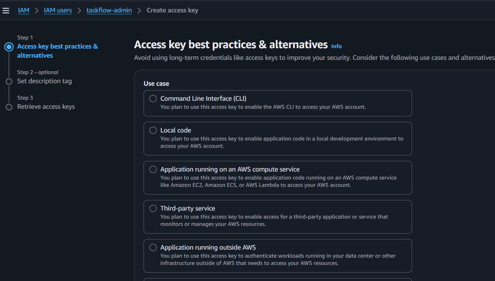

**Captura 31.** Se inició la creación de una access key para el usuario **taskflow-admin** y se seleccionó el uso mediante Command Line Interface (CLI).

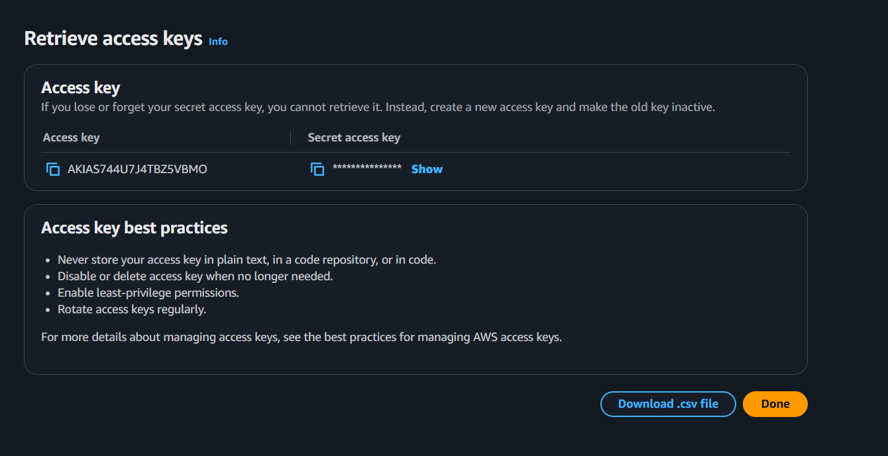

**Captura 32.** Se recuperaron las credenciales para configurar la CLI. 

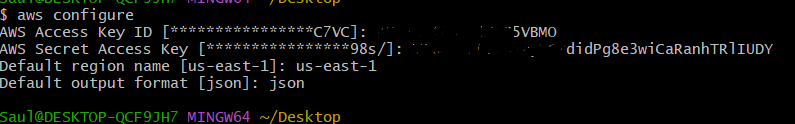

**Captura 33.** Se ejecutó **aws configure** y se definieron las credenciales, la región de trabajo y el formato de salida JSON.

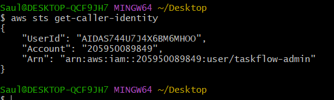

**Captura 34.** Se validó la configuración con **aws sts get-caller-identity**. El resultado confirmó que la CLI quedo autentificada con el usuario IAM correcto.

### 2. Rol y nueva instancia EC2

Para el siguiente despliegue se creó el rol **taskflow-ec2-role**. Este rol da permiso necesario para leer artefactos desde S3. 

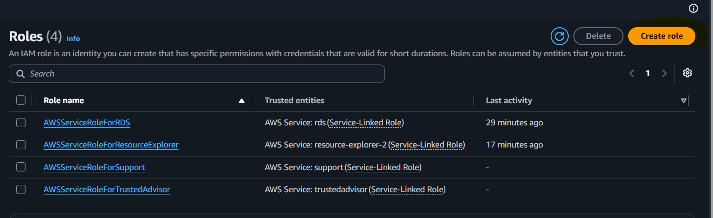

**Captura 35.** Se ingresó a la sección de roles de IAM para iniciar la creación del rol que utilizará la instancia EC2.

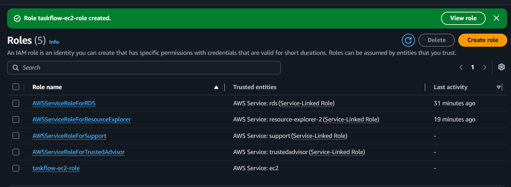

**Captura 36.** Se creó el rol **taskflow-ec2-role** para que pueda ser asignado a una instancia EC2.

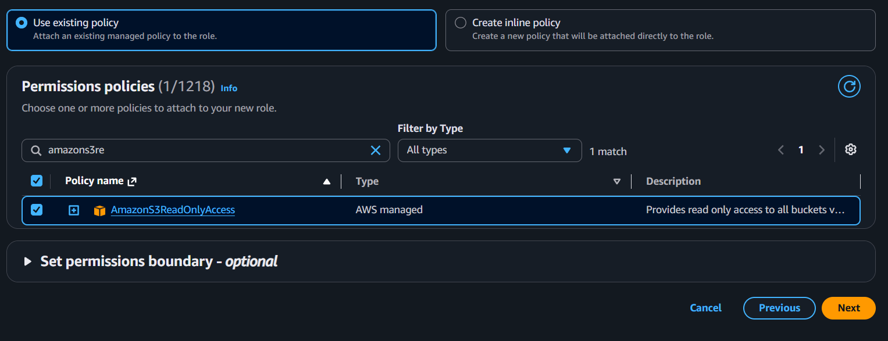

**Captura 37.** Se verificó que el rol tiene solo lectura para S3 antes de utilizarlo en EC2.

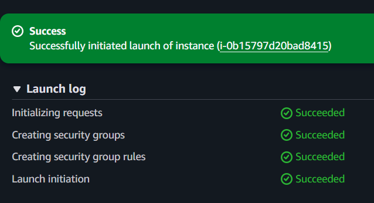

**Captura 38.** Se lanzó una nueva instancia EC2.

### 3. Creación de la tabla DynamoDB

 Para esta practica se creo la tabla **taskflow-eventos** con la clave de partición es **taskId**.

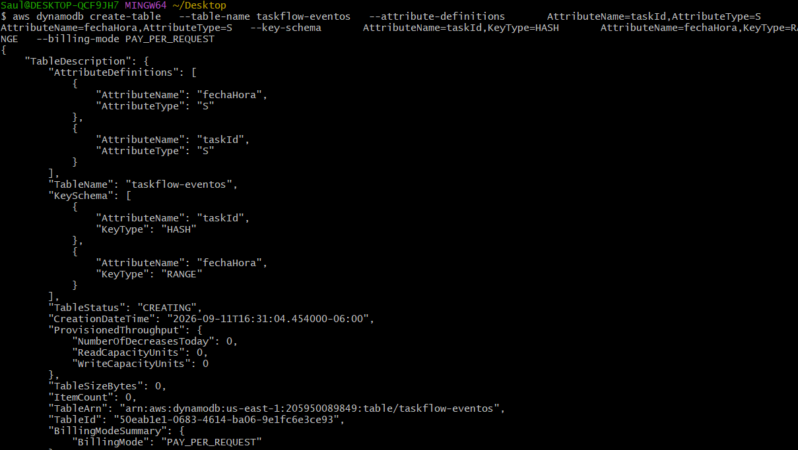

**Captura 39.** Se verifica si se creo la tabla **taskflow-eventos** desde la AWS CLI. 

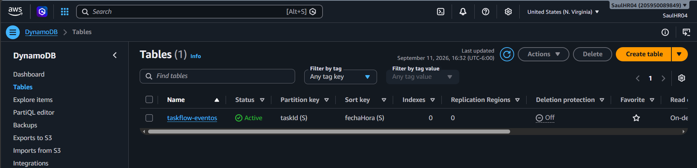

**Captura 40.** Se comprobó en la consola que la tabla quedó en estado **Active**..

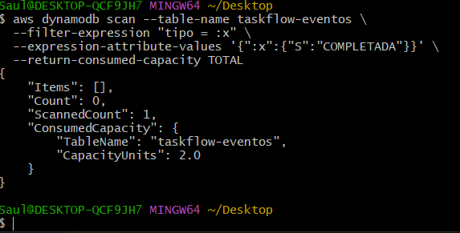

**Captura 41.** Se ejecutó un **scan**.

##  Preparación del pipeline y codeploy (Hasta lo permitido)

En esta etapa se preparó la automatización del despliegue. El objetivo es que mas adelante, con solo un **git push** inicie el proceso sin subir manualmente el archivo JAR a EC2. GitHub guarda el código, CodeBuild genera el artefacto, S3 lo almacena y CodeDeploy lo instala en la instancia.

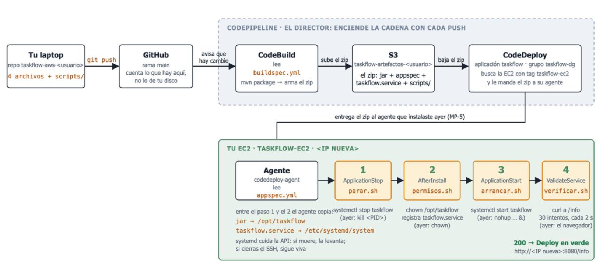

**Captura 42.** Flujo de Codepipeline y CodeDeploy proporcionado por el instructor donde se muestra el recorrido que se hacepara llegar al deploy.

### 1. Bucket para artefactos

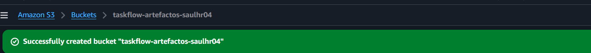

**Captura 43.** Se creó el bucket **taskflow-artefactos-saulhr04**. Donde se almacenaran temporalmente los archivos que pasaran de CodeBuild a CodeDeploy.

### 2. Agente de CodeDeploy en EC2

 Se instaló el agente dentro de EC2 y se verific que el servicio quedó activo y/o running para comprobar si el agente se encuentra iniciado.

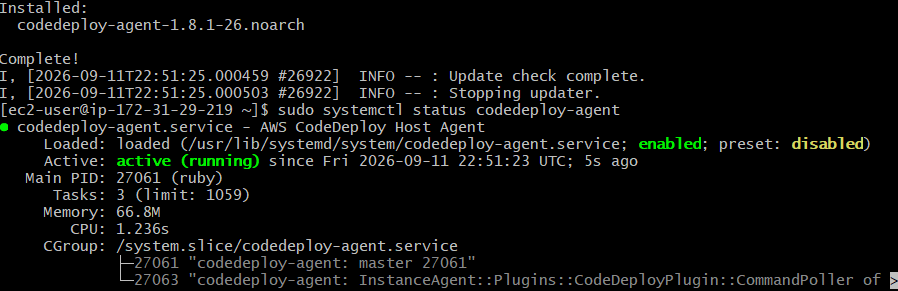

**Captura 44.** Se comprobo que **codedeploy-agent** esta en estado **active (running)** dentro de EC2. 

### 3. Archivos de automatización en GitHub

Se agregaron al repositorio los archivos que definen cómo se construye e instala la aplicación. **buildspec.yml** indica a CodeBuild cómo generar el JAR; **appspec.yml** indica a CodeDeploy qué archivos copiar; **taskflow.service** registra la API como servicio y la carpeta **scripts** contiene los pasos para detener, preparar, iniciar y validar la aplicación.

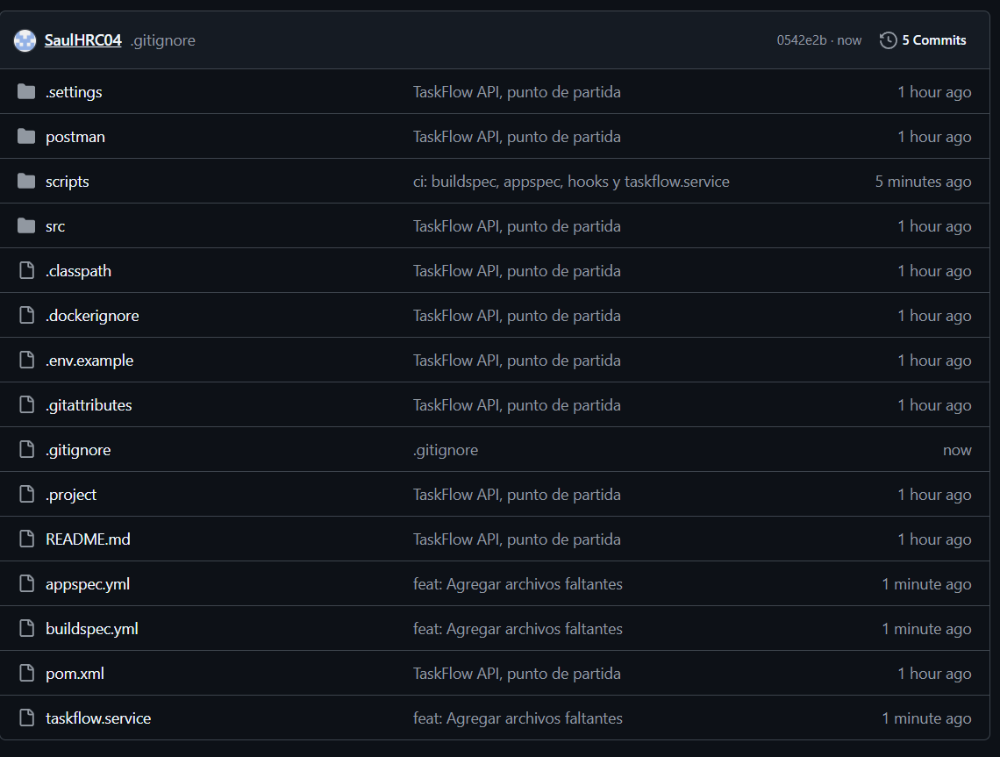

**Captura 45.** Se comprobo que los archivos **buildspec.yml**, **appspec.yml**, **taskflow.service** y la carpeta **scripts** fueron subidos al repositorio de GitHub correctamente.

### 4. Rol de servicio para CodeDeploy

Se creó un rol para que AWS CodeDeploy pueda trabajar con las instancias seleccionadas durante el despliegue. 

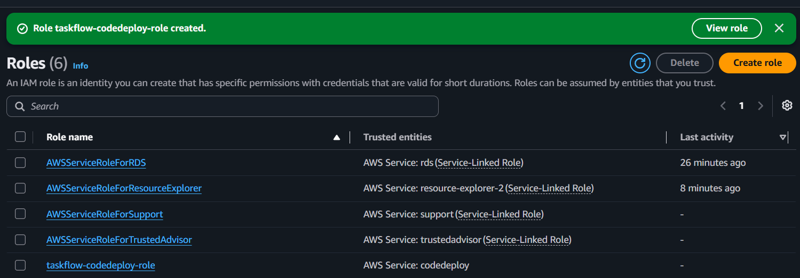

**Captura 46.** Se creó el rol **taskflow-codedeploy-role**. (Hasta aqui nos dejo la capa gratis que nos ofrece AWS).
